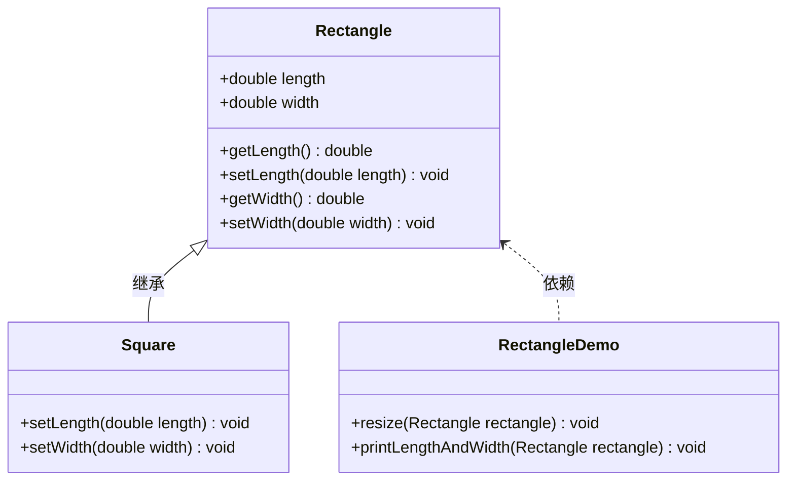
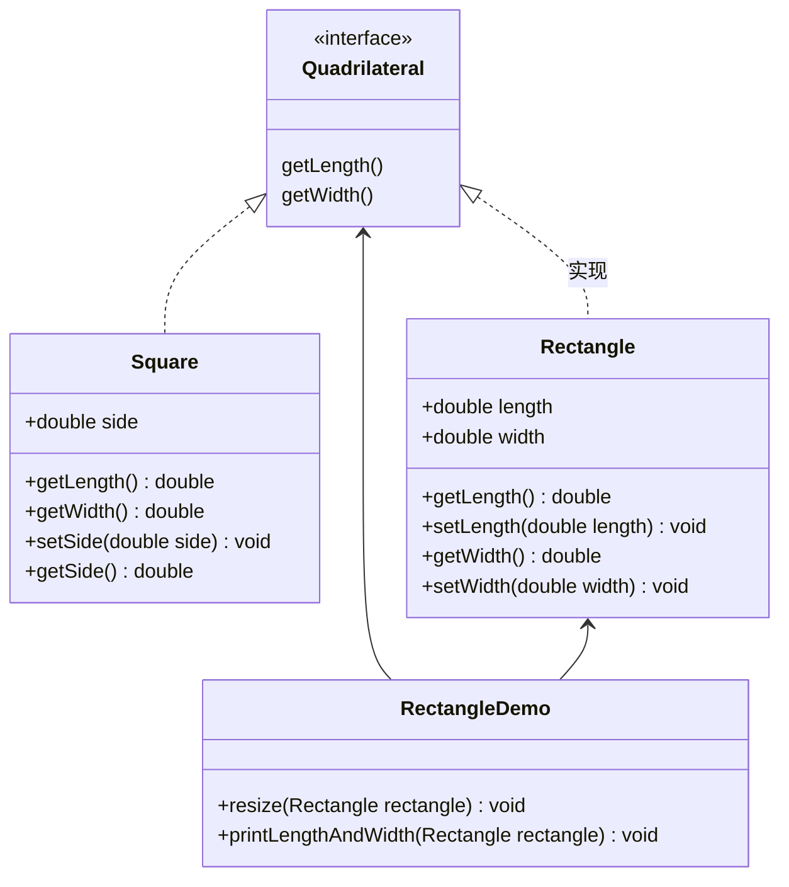

# 里氏代换原则

里氏代换原则是面向对象设计的基本原则之一。

里氏代换原则：任何基类可以出现的地方，子类一定可以出现。通俗理解：子类可以扩展父类的功能，但不能改变父类原有的功能。换句话说，子类继承父类时，除添加新的方法完成新增功能外，尽量不要重写父类的方法。

如果通过重写父类的方法来完成新的功能，这样写起来虽然简单，但是整个继承体系的可复用性会比较差，特别是运用多态比较频繁时，程序运行出错的概率会非常大。

下面看一个里氏替换原则中经典的一个例子

:::tip 【例】正方形不是长方形。
在数学领域里，正方形毫无疑问是长方形，它是一个长宽相等的长方形。所以，我们开发的一个与几何图形相关的软件系统，就可以顺理成章的让正方形继承自长方形。
:::


**长方形类（Rectangle)：**

```java
package com.notecove.designpractice.lsdh.before;

public class Rectangle {
    private double length;
    private double width;

    public double getLength() {
        return length;
    }

    public void setLength(double length) {
        this.length = length;
    }

    public double getWidth() {
        return width;
    }

    public void setWidth(double width) {
        this.width = width;
    }
}

```
**正方形（Square）：**
由于正方形的长和宽相同，所以在方法setLength和setWidth中，对长度和宽度都需要赋相同值。

```java
public class Square extends Rectangle {
    
    public void setWidth(double width) {
        super.setLength(width);
        super.setWidth(width);
    }

    public void setLength(double length) {
        super.setLength(length);
        super.setWidth(length);
    }
}
```
类RectangleDemo是我们的软件系统中的一个组件，它有一个resize方法依赖基类Rectangle，resize方法是RectandleDemo类中的一个方法，用来实现宽度逐渐增长的效果。
```java
package com.notecove.designpractice.lsdh.before;

public class RectangleDemo {

    public static void resize(Rectangle rectangle) {
        while (rectangle.getWidth() <= rectangle.getLength()) {
            rectangle.setWidth(rectangle.getWidth() + 1);
        }
    }

    //打印长方形的长和宽
    public static void printLengthAndWidth(Rectangle rectangle) {
        System.out.println(rectangle.getLength());
        System.out.println(rectangle.getWidth());
    }

    public static void main(String[] args) {
        Rectangle rectangle = new Rectangle();
        rectangle.setLength(20);
        rectangle.setWidth(10);
        resize(rectangle);
        printLengthAndWidth(rectangle);

        System.out.println("============");

        Rectangle rectangle1 = new Square();
        rectangle1.setLength(10);
        resize(rectangle1);
        printLengthAndWidth(rectangle1);
    }
}

```
测试发现：

**长方形能正常扩宽，而正方形执行的时候却阻塞了（其实是一直在循环），因为正方形的长和宽是一直相等的，所有跳不出resize方法的while循环**
我们运行一下这段代码就会发现，假如我们把一个普通长方形作为参数传入resize方法，就会看到长方形宽度逐渐增长的效果，当宽度大于长度,代码就会停止，这种行为的结果符合我们的预期；假如我们再把一个正方形作为参数传入resize方法后，就会看到正方形的宽度和长度都在不断增长，代码会一直运行下去，直至系统产生溢出错误。所以，普通的长方形是适合这段代码的，正方形不适合。我们得出结论：在resize方法中，Rectangle类型的参数是不能被Square类型的参数所代替，如果进行了替换就得不到预期结果。因此，Square类和Rectangle类之间的继承关系违反了里氏代换原则，它们之间的继承关系不成立，正方形不是长方形。
如何改进呢？此时我们需要重新设计他们之间的关系。抽象出来一个四边形接口(Quadrilateral)，让Rectangle类和Square类实现Quadrilateral接口

代码如下：
**四边形类（**Quadrilateral**)：**

```java
package com.notecove.designpractice.lsdh.after;

/**
 * 四边形接口
 */
public interface Quadrilateral {
    public double getLength();
    public double getWidth();
}

```
**正方形（Square）：**
```java
package com.notecove.designpractice.lsdh.after;

/**
 * 正方形
 */
public class Square implements Quadrilateral {

    //正方形只需要设置边长
    private double side;

    public void setSide(double side) {
        this.side = side;
    }

    @Override
    public double getLength() {
        return side;
    }

    @Override
    public double getWidth() {
        return side;
    }
}

```
**长方形类（Rectangle）：**
```java
package com.notecove.designpractice.lsdh.after;

/**
 * 长方形
 */
public class Rectangle implements Quadrilateral{
    private double length;
    private double width;


    public void setLength(double length) {
        this.length = length;
    }

    public void setWidth(double width) {
        this.width = width;
    }

    @Override
    public double getLength() {
        return length;
    }

    @Override
    public double getWidth() {
        return width;
    }
}

```
类RectangleDemo是我们的软件系统中的一个组件，它有一个resize方法依赖基类Rectangle，resize方法是RectandleDemo类中的一个方法，用来实现宽度逐渐增长的效果。
```java
package com.notecove.designpractice.lsdh.after;

import com.notecove.designpractice.lsdh.after.Rectangle;
import com.notecove.designpractice.lsdh.after.Square;

public class RectangleDemo {

    public static void resize(Rectangle rectangle) {
        while (rectangle.getWidth() <= rectangle.getLength()) {
            rectangle.setWidth(rectangle.getWidth() + 1);
        }
    }

    //打印长方形的长和宽
    public static void printLengthAndWidth(Quadrilateral quadrilateral) {
        System.out.println(quadrilateral.getLength());
        System.out.println(quadrilateral.getWidth());
    }

    public static void main(String[] args) {
        Rectangle rectangle = new Rectangle();
        rectangle.setLength(20);
        rectangle.setWidth(10);
        resize(rectangle);
        printLengthAndWidth(rectangle);
    }
}

```
**resize 方法只能传入长方形对象，不能传入正方形方法，解决之前的问题（父类能用的方法，到了子类就会有问题），将长方形和正方形解耦。**

